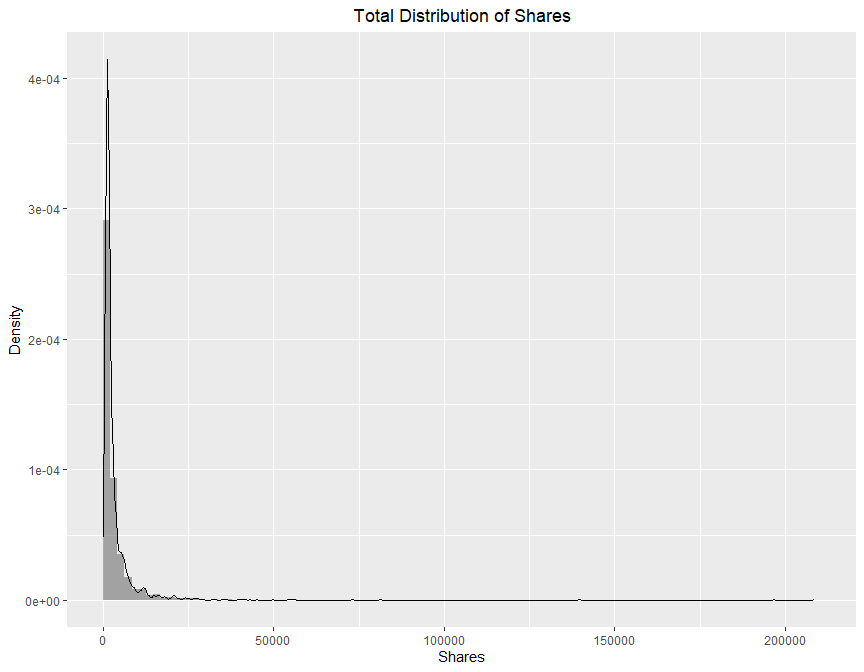
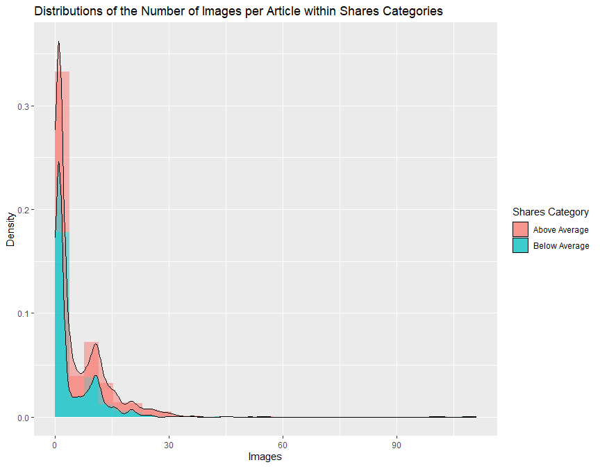

Analysis of the Online News Popularity Dataset
================
Suprotik Debnath and Michael Lightfoot


-   [Introduction](#introduction)
-   [Data](#data)
-   [Summarizations](#summarizations)
-   [Modeling](#modeling)
    -   [Four Fitted Models](#four-fitted-models)
-   [Comparison](#comparison)
-   [Automation](#automation)

## Introduction

We are working with the Online News Popularity Dataset from the UCI
Machine Learning Repository. You can find more information about this
dataset
[here](https://archive.ics.uci.edu/ml/datasets/Online+News+Popularity).

The goal of this analysis is to produce models in order to predict the
number of shares a website gathers. We will break up this analysis by
`data_channel`, which has 6 categories:

-   Lifestyle
-   Entertainment
-   Business
-   Social Media
-   Tech
-   World

We will automate the model selection and analysis report creation across
all data channels.

Looking at the data, after breaking it up by data channel, we are left
with 51 predictive attributes to help us predict the `shares` variable.
These variables have broad groups:

-   Variables referencing various counts of different types of content
    withing the article.
-   Variables referencing the keywords within the article.
-   Variables referencing statistics of shares in Mashable.
-   Variables referencing day of publishing.
-   Variables referencing closeness to LDA of the topics (Latent
    Dirichlet Allocation)
-   Variables referencing content polarity.

We will likely focus heavily on the variables regarding LDA, statistics
of shares, and the counts of different types of content.

We will utilize various methods to model the response, including random
forest, boosted tree, and linear regression models.

## Data

First, we will read in the data. Then, we will subset the data based on
the variable of interest, and then remove those variables from our
analysis. We are going to create a new factored variable called
`weekday` that merges all the `weekday_is` variables and labels articles
by what day they were published. We will also remove the `url` and
`timedelta` variables for the sake of our analysis as those are
non-predictive.

``` r
#Import packages
library(readr)
library(tidyverse)
library(ggplot2)
library(ggpubr)
library(scales)
library(caret)
library(knitr)
library(rmarkdown)
library(dplyr)

#Read in data 
data <- read_csv("OnlineNewsPopularity/OnlineNewsPopularity.csv")
data <- na.omit(as_tibble(data))

#Create new variables and remove non-needed variables
subdata <- data %>%
  mutate(
    weekday = case_when(
      weekday_is_monday == "1" ~ "Monday",
      weekday_is_tuesday == "1" ~ "Tuesday",
      weekday_is_wednesday == "1" ~ "Wednesday",
      weekday_is_thursday == "1" ~ "Thursday",
      weekday_is_friday == "1" ~ "Friday",
      weekday_is_saturday == "1" ~ "Saturday",
      weekday_is_sunday == "1" ~ "Sunday"
    ),
    channel = case_when(
      data_channel_is_lifestyle == "1" ~ "Lifestyle",
      data_channel_is_entertainment == "1" ~ "Entertainment",
      data_channel_is_bus == "1" ~ "Business",
      data_channel_is_socmed == "1" ~ "Social Media",
      data_channel_is_tech == "1" ~ "Tech",
      data_channel_is_world == "1" ~ "World"
    )
  ) %>%
  select(
    -c(
      url,
      timedelta,
      weekday_is_monday,
      weekday_is_tuesday,
      weekday_is_wednesday,
      weekday_is_thursday,
      weekday_is_friday,
      weekday_is_saturday,
      weekday_is_sunday,
      is_weekend,
      data_channel_is_lifestyle,
      data_channel_is_entertainment,
      data_channel_is_bus,
      data_channel_is_socmed,
      data_channel_is_tech,
      data_channel_is_world
    )
  )

#Now, we subset our data based on the channel of interest
data_life <- subdata %>% filter(channel == params$channel)

#Let's make sure our weekday variable is a factor so it can be 
#used in our analysis
data_life$weekday <- as.factor(data_life$weekday)

#Since we have already subset the data, let's remove the channel variable
data_life <- data_life %>% select(-channel)
```

## Summarizations

We will create some summary statistics and plots to help us understand
our data. To get an idea of our response variable, let’s look at the
distribution of `shares`.

``` r
stats1 <- data_life %>% 
  select(shares) %>% 
  summarise(avg = round(mean(shares)), 
            med = median(shares), 
            sd = round(sd(shares)))
kable(stats1, "simple", 
      col.names = c("Average", "Median", "Std Dev"))
```

| Average | Median | Std Dev |
|--------:|-------:|--------:|
|    3682 |   1700 |    8885 |

This helps us understand the number of shares an article within this
channel needs to be considered above average, and so forth.

Let’s visualize this distribution of `shares`.

``` r
plot1 <- ggplot(data_life, aes(x=shares)) + 
  geom_histogram(alpha = 0.5, aes(y = ..density..), bins = 100, boundary = 0) + 
  geom_density(alpha = 0.5, kernel = "gaussian", position = "stack") +
  ggtitle("Total Distribution of Shares") + 
  xlab("Shares") + 
  ylab("Density") + 
  theme(plot.title = element_text(hjust = 0.5))
plot1
```

<!-- -->

Looking at the width and height of the peak(s) of this plot can help us
understand the distribution of `shares` a bit better.

Our exploratory data analysis may benefit from a categorical variable
that splits article into categories based on their number of shares
compared to the mean. Let’s create that variable.

``` r
data_life$shares_cat <- ifelse(data_life$shares <= stats1$avg, 
                              "Below Average", 
                              "Above Average")
```

Now, let us look at these same summary statistics of `shares` grouped by
the `weekday` variable.

``` r
stats2 <- data_life %>% 
  group_by(weekday) %>% 
  summarise(avg = round(mean(shares)), 
            med = median(shares), 
            sd = round(sd(shares)))
kable(stats2, "simple",
      col.names = c("Weekday", "Average", "Median", "Std Dev"))
```

| Weekday     |    Average |   Median |                                                                                                                                                                                                                                                                                                               Std Dev |
|:------------|-----------:|---------:|----------------------------------------------------------------------------------------------------------------------------------------------------------------------------------------------------------------------------------------------------------------------------------------------------------------------:|
| Friday      |       3026 |     1500 |                                                                                                                                                                                                                                                                                                                  4540 |
| Monday      |       4346 |     1600 |                                                                                                                                                                                                                                                                                                                 14073 |
| Saturday    |       4062 |     2100 |                                                                                                                                                                                                                                                                                                                  5351 |
| Sunday      |       3790 |     2100 |                                                                                                                                                                                                                                                                                                                  4772 |
| Thursday    |       3500 |     1600 |                                                                                                                                                                                                                                                                                                                  5821 |
| Tuesday     |       4152 |     1500 |                                                                                                                                                                                                                                                                                                                 13544 |
| Wednesday   |       3173 |     1600 |                                                                                                                                                                                                                                                                                                                  5608 |
| Here we are | looking to | see if c | ertain days have significantly different statistics than the overall statistics for `shares` that we observed above. These statistical summaries by `weekday` may benefit from the context of how many articles with above and below average numbers of shares were released on each day. Let’s look at that as well. |

``` r
stats3 <- table(data_life$weekday, data_life$shares_cat)
stats3
```

    ##            
    ##             Above Average Below Average
    ##   Friday               59           246
    ##   Monday               77           245
    ##   Saturday             52           130
    ##   Sunday               58           152
    ##   Thursday             78           280
    ##   Tuesday              71           263
    ##   Wednesday            74           314

``` r
kable(stats3, "simple")
```

|           | Above Average | Below Average |
|-----------|--------------:|--------------:|
| Friday    |            59 |           246 |
| Monday    |            77 |           245 |
| Saturday  |            52 |           130 |
| Sunday    |            58 |           152 |
| Thursday  |            78 |           280 |
| Tuesday   |            71 |           263 |
| Wednesday |            74 |           314 |

Here we are looking to see if there are vastly different numbers of
articles in either category released on certain days than others. Let’s
look at a plot of `shares` by `weekday` to help us visualize this
relationship better.

``` r
plot2 <- ggplot(data_life, aes(x=weekday, y=shares, fill=shares_cat)) + 
  geom_bar(stat='identity') +  
  ggtitle("Number of Total Shares by Day") +
  xlab("Weekday") + 
  ylab("Shares")  + 
  theme(plot.title = element_text(hjust = 0.5)) + 
  labs(fill = "Shares Category")
plot2
```

<!-- -->

Again, we are looking for weekdays that have much higher or lower
numbers of shares than other days to help confirm if `weekday` might be
a solid predictor for our models.

Now let’s look at the correlations between our `shares` variable and the
other numerical variables within our dataset.

``` r
cor <- cor((data_life[, unlist(lapply(data_life, is.numeric))]), data_life$shares)   
cor <- data.frame(Correlation=cor)
cor <- cor %>%
  arrange(desc(Correlation))

kable(cor, "simple")
```

|                                 | Correlation |
|---------------------------------|------------:|
| shares                          |   1.0000000 |
| kw\_avg\_avg                    |   0.0915190 |
| num\_videos                     |   0.0883111 |
| n\_tokens\_content              |   0.0730243 |
| self\_reference\_min\_shares    |   0.0723982 |
| LDA\_03                         |   0.0680432 |
| kw\_max\_avg                    |   0.0536119 |
| num\_hrefs                      |   0.0535864 |
| num\_imgs                       |   0.0512013 |
| self\_reference\_avg\_sharess   |   0.0424044 |
| kw\_max\_max                    |   0.0367688 |
| kw\_avg\_max                    |   0.0313892 |
| abs\_title\_subjectivity        |   0.0311660 |
| global\_rate\_negative\_words   |   0.0296872 |
| rate\_negative\_words           |   0.0251372 |
| kw\_min\_max                    |   0.0206672 |
| num\_keywords                   |   0.0196917 |
| self\_reference\_max\_shares    |   0.0188409 |
| kw\_min\_avg                    |   0.0182612 |
| LDA\_00                         |   0.0182579 |
| global\_subjectivity            |   0.0177399 |
| kw\_max\_min                    |   0.0134015 |
| max\_negative\_polarity         |   0.0123423 |
| kw\_avg\_min                    |   0.0102151 |
| avg\_positive\_polarity         |   0.0090621 |
| title\_subjectivity             |   0.0049712 |
| abs\_title\_sentiment\_polarity |   0.0007177 |
| max\_positive\_polarity         |  -0.0035600 |
| n\_tokens\_title                |  -0.0040871 |
| title\_sentiment\_polarity      |  -0.0047793 |
| global\_rate\_positive\_words   |  -0.0053958 |
| min\_positive\_polarity         |  -0.0068058 |
| n\_non\_stop\_unique\_tokens    |  -0.0138998 |
| num\_self\_hrefs                |  -0.0164329 |
| global\_sentiment\_polarity     |  -0.0223047 |
| LDA\_01                         |  -0.0266725 |
| n\_non\_stop\_words             |  -0.0278558 |
| n\_unique\_tokens               |  -0.0296771 |
| avg\_negative\_polarity         |  -0.0304221 |
| average\_token\_length          |  -0.0305632 |
| kw\_min\_min                    |  -0.0359571 |
| LDA\_02                         |  -0.0367996 |
| LDA\_04                         |  -0.0400059 |
| rate\_positive\_words           |  -0.0415855 |
| min\_negative\_polarity         |  -0.0475614 |

Of course, the shares variable has a perfect correlation with itself.
What we are looking for here are the other variables with strong
correlations (positive or negative) as those could be solid predictors
for the `shares` variable.

Let’s visualize the relationship between some of these numerical
variables and `shares`. First, let’s look at `shares` versus the number
of words in the content of each article, colored by the text sentiment
polarity.

``` r
plot3 <- ggplot(data_life, aes(x = n_tokens_content, y = shares, color = global_sentiment_polarity)) + 
  geom_point() + 
  xlab("Words in the Content") + 
  ylab("Shares") + 
  ggtitle("Number of Shares vs Number of Words in the Content")  + 
  labs(color = "Text Sentiment Polarity") +
  theme(plot.title = element_text(hjust = 0.5))
plot3
```

<!-- -->

Here, we are looking for trends in the scatter plot along with potential
clusters of different clusters to help us decipher if these numerical
variables will be strong predictors of `shares`.

Now let’s visualize the relationship between `shares` and the number of
videos in each article, colored by the text subjectivity.

``` r
plot4 <- ggplot(data_life, aes(x=num_videos, y=shares, color=global_subjectivity)) + 
  geom_point() + 
  ggtitle("Number of Shares vs Number of Videos") + 
  xlab("Videos") + 
  ylab("Shares") + 
  labs(color = "Text Subjectivity") +
  theme(plot.title = element_text(hjust = 0.5))
plot4
```

<!-- -->

We are looking for similar indicators as the previous plot: trends in
the scatter plot and clusters of certain colors that show dependence of
`shares` on these variables.

Now let’s take a different visualization approach and look at the
distribution of the number of images, colored by if the articles have
above or below the average number of shares.

``` r
plot5 <- ggplot(data_life, aes(x = num_imgs, fill = shares_cat)) + 
  geom_histogram(alpha = 0.5, aes(y = ..density..), bins = 30, boundary = 0) + 
  geom_density(alpha = 0.5, position = "stack") +
  labs(title = "Distributions of the Number of Images per Article within Shares Categories",
       x = "Images",
       y = "Density",
       fill = "Shares Category")
plot5
```

<!-- -->

To see if the number of images is a significant predictor of `shares`,
we are looking for a large difference in the density curves for the two
categories. Let’s perform this same visualization with the number of
links per article.

``` r
plot6 <- ggplot(data_life, aes(x = num_hrefs, fill = shares_cat)) + 
  geom_histogram(alpha = 0.5, aes(y = ..density..), bins = 30, boundary = 0) + 
  geom_density(alpha = 0.5, position = "stack") +
  labs(title = "Distributions of the Number of Links per Article within Shares Categories",
       x = "Links",
       y = "Density",
       fill = "Shares Category")
plot6
```

<!-- -->

Again, we are looking to see if the density curves of this variable are
vastly different between the different categories of `shares`.

Lastly, a more helpful analysis may be to group our data by these
categories of `shares` and create some summary statistics. Let’s
consider some variables we have yet to explore: the average length of
words in the context as well as the number of keywords.

``` r
stats4 <- data_life %>% 
  group_by(shares_cat) %>% 
  summarise(avg = round(mean(average_token_length), digits = 3), 
            med = median(average_token_length), 
            sd = round(sd(average_token_length), digits = 3))
kable(stats4, "simple", 
      col.names = c("Shares Category", "Average", "Median", "Std Dev"))
```

| Shares Category | Average |   Median | Std Dev |
|:----------------|--------:|---------:|--------:|
| Above Average   |   4.520 | 4.619318 |   0.779 |
| Below Average   |   4.608 | 4.620599 |   0.451 |

We are looking to see if the summary statistics in each category here
are vastly different in order to determine if the average length of
words in an article is a good predictor of `shares`.

``` r
stats5 <- data_life %>% 
  group_by(shares_cat) %>% 
  summarise(avg = round(mean(num_keywords), digits = 3), 
            med = median(num_keywords), 
            sd = round(sd(num_keywords), digits = 3))
kable(stats5, "simple", 
      col.names = c("Shares Category", "Average", "Median", "Std Dev"))
```

| Shares Category | Average | Median | Std Dev |
|:----------------|--------:|-------:|--------:|
| Above Average   |   8.330 |      9 |   1.635 |
| Below Average   |   8.201 |      8 |   1.682 |

Again, here we could claim the number of key words in an article could
be a solid predictor of `shares` if these summary statistics vary
drastically between these categories.

Also, let’s not forget to get rid of that categorical variable we made
before we start building our models!

``` r
data_life <- data_life %>%
  select(-shares_cat)
```

## Modeling

First, let’s create the testing and training data needed to generate our
models. We will be using a 70/30 training and testing split of our data.

``` r
set.seed(123)
train <- sample(1:nrow(data_life), size = nrow(data_life)*0.7)
test <- setdiff(1:nrow(data_life),train)

train_life <- data_life[train, ]
test_life <- data_life[test, ]
```

After splitting the data, we will be creating four unique models: two
linear regression models and two ensemble models.

### Four Fitted Models

A Linear Regression model measures the relationship between a number of
predictors `x` and a dependent variable `y`. In simple linear
regression, only one predictor variable is used. However, in more
complex modeling using multiple linear regression, we use either
polynomial regression to fit higher order terms or focusing on
main/interaction effects and max combinations.

For an accurate comparison, we will utilize 5-fold cross-validation for
each model. We will pick the model with the lowest RMSE when applied to
the test data.

Our first linear regression model is as follows:

E(*Shares*) = *β*<sub>0</sub> + *β*<sub>1</sub>×(*Average Keywords*) +
*β*<sub>2</sub>×(*Number of Images*) + *β*<sub>3</sub>×(*Number of
Videos*) + *β*<sub>4</sub>×(*Number of Videos*)×(*Number of Images*)

``` r
#Creating train controls that will be applied to all models.
tr_control <- trainControl(method = "cv", number = 5)

#Creating first linear regression model.
mlrfit1 <- train(shares ~ kw_avg_avg + num_videos + num_imgs + num_videos*num_imgs, 
                 data = train_life, 
                 method = "lm", 
                 trControl = tr_control)

#Test model on test data
mlrfit1_pred <- predict(mlrfit1, newdata = test_life)
output1 <- postResample(mlrfit1_pred, test_life$shares)

#Save RMSE for comparison
RMSE1 <- output1[1]
```

Our second linear regression model will include all predictive variables
as only “main effect” terms:

E(*Shares*) = *β*<sub>0</sub> + *β*<sub>1</sub>×(*Number of Words in
Title*) + *β*<sub>2</sub>×(*Number of Words in Content*)…

``` r
#Creating second linear regression model.
mlrfit2 <- train(shares ~ ., 
                 data = train_life, 
                 method = "lm", 
                 trControl = tr_control)

#Test model on test data
mlrfit2_pred <- predict(mlrfit2, newdata = test_life)
output2 <- postResample(mlrfit2_pred, test_life$shares)

#Save RMSE for comparison
RMSE2 <- output2[1]
```

Now, we will try a random forest model. This kind of model randomly
selects subsets of predictors from the training data and creates a set
of decision trees for each subset. Then we have a vote for the
prediction of our response variable from each decision tree. The average
of all of those results is the overall prediction of the random forest
model.

``` r
#Create small tune grid around sqrt(ncol) for efficiency
root_ncol = round(sqrt(ncol(train_life)))
start = root_ncol - 2
end = root_ncol + 2

#Create model
rforest <- train(shares ~ ., 
               method = 'rf', 
               trControl =  tr_control, 
               data = train_life, 
               preProcess = c("center", "scale"),
               tuneGrid = expand.grid(mtry=c(start:end)))

#Test model on test data.
rforest_pred <- predict(rforest, newdata = test_life)
output3 <- postResample(rforest_pred, test_life$shares)

#Save RMSE for comparison
RMSE3 <- output3[1]
```

Lastly, we will try a boosted tree model. This model has a very similar
process to the random forest model. The main difference is that the
decision trees are instead grown one after another, with each tree
growing on a modified version of the data. The predictions of our
response variable are then updated as the model progresses. Generally,
this model is slower but more accurate than the random forest model.

``` r
#Create Training model
gbm <- train(shares ~ ., 
               method = 'gbm', 
               trControl = tr_control,
               data = train_life, 
               preProcess = c("center", "scale"),
               tuneGrid = expand.grid(n.trees = c(25,50,100,150,200),
                                     interaction.depth = c(1:4),
                                     shrinkage = 0.1,
                                     n.minobsinnode = 10))
```

``` r
#Test model on test data.
gbm_pred <- predict(gbm, newdata = test_life)
output4 <- postResample(gbm_pred, test_life$shares)

#Save RMSE for comparison
RMSE4 <- output4[1]
```

## Comparison

Now, we need to select the best model by comparing the RMSE of each
model.

``` r
RMSE_list <- c(RMSE1, RMSE2, RMSE3, RMSE4)

RMSE_compare <- function(RMSE_list) {
  if (min(RMSE_list) == RMSE_list[1]) {
    return(paste("We will choose the first linear regression model! The winning RMSE was:", round(min(RMSE_list), digits = 2)))
  } else if (min(RMSE_list) == RMSE_list[2]) {
    return(paste("We will choose the second linear regression model! The winning RMSE was:", round(min(RMSE_list), digits = 2)))
  } else if (min(RMSE_list) == RMSE_list[3]) {
    return(paste("We will choose the random forest model! The winning RMSE was:", round(min(RMSE_list), digits = 2)))
  } else if (min(RMSE_list) == RMSE_list[4]) {
    return(paste("We will choose the boosted tree model! The winning RMSE was:", round(min(RMSE_list), digits = 2)))
  }
}

RMSE_compare(RMSE_list)
```

    ## [1] "We will choose the first linear regression model! The winning RMSE was: 4801.3"

## Automation

Below, we simply wanted to show the code used to automate the creation
of the documents.

``` r
#Get channels
channels <- unique(na.omit(subdata$channel))

#Create filenames
output_file <- paste0(channels, "Analysis.md")

#Create lists of parameters
params <- lapply(channels, FUN = function(x){list(channel = x)})

#Put into data frame
reports <- tibble(output_file, params)

#Automate creation of documents
apply(reports, MARGIN = 1,
      FUN = function(x){
        params = x[[2]]
        print(params$channel)
        render(input = "ST558_Proj2.Rmd", ,
               output_format = "github_document", 
               output_file = x[[1]], 
               output_options = list(
                    df_print = "default",
                    toc = TRUE,
                    number_sections = FALSE),
               params = x[[2]])
      })
```
